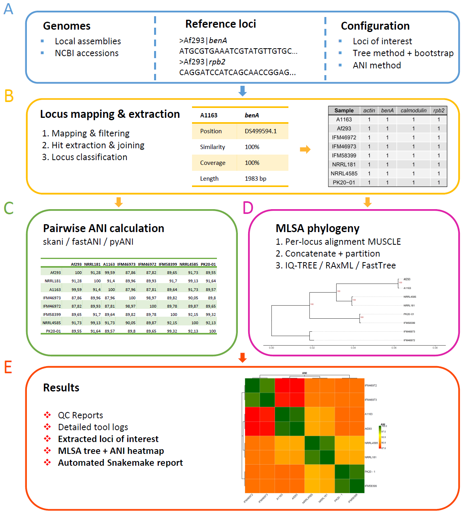

:::::::::::::::::::::::::::::::::::::: questions

- How can a small set of conserved loci be used to compare *Aspergillus fumigatus* genomes?
- How can MLSA be used for species confirmation?
- What does the MLSA workflow extract, align, and summarise?
- How should we interpret an MLSA tree in relation to isolate relatedness?
- What are the limitations of MLSA compared with whole-genome SNP analysis?

::::::::::::::::::::::::::::::::::::::::::::::::

::::::::::::::::::::::::::::::::::::: objectives

- Explain the purpose of multilocus sequence analysis (MLSA) in an *A. fumigatus* genomics workflow.
- Identify the genome assemblies, reference loci, and configuration settings used by the MLSA pipeline.
- Inspect the selected loci and understand how the workflow validates and extracts them.
- Locate the main MLSA outputs: gene QC tables, per-locus alignments, concatenated alignment, and tree file.

::::::::::::::::::::::::::::::::::::::::::::::::

## Introduction

In this episode we use multilocus sequence analysis, abbreviated **MLSA**, to compare
*A. fumigatus* genome assemblies. MLSA focuses on a small number of conserved genes
or loci rather than on the full genome. The selected loci are extracted from each
assembly, aligned, concatenated, and used to infer a phylogenetic tree.

This is useful as an early comparison of isolates. It can show whether genomes are
broadly similar at the selected loci and whether any isolate is unexpectedly distant
from the rest of the sample pool. 
Furthermore can it be used to confirm species identification, by comparing the clustering to previously identified samples.

However, MLSA has lower resolution than whole-genome SNP analysis. For suspected transmission, outbreak reconstruction, or
relatedness between very similar *A. fumigatus* isolates, whole-genome SNP analysis
is more informative.

In this session we will use the following tool we developed:

**[snakemake-mlsa-ani](https://github.com/westerdijk-wm/snakemake-mlsa-ani/)**



::::::::::::::::::::::::::::::::::::: callout

## MLSA and MLST are related but not identical

**MLSA** means multilocus sequence analysis: comparison of several loci, often for phylogenetic placement.

**MLST** means multilocus sequence typing: assignment of allele profiles or sequence
types using a formal typing scheme. MLST is for example used for *Cryptococcus neofrmans* and *C. gattii* typing [(ref)](https://pmc.ncbi.nlm.nih.gov/articles/PMC2884100/). 

This episode uses the term **MLSA** because the workflow extracts selected loci,
aligns them, concatenates them, and builds a phylogenetic tree. If a different
workflow assigns formal allele numbers or sequence types, that would be described
as MLST.

::::::::::::::::::::::::::::::::::::::::::::::::

## What the workflow does

The MLSA workflow starts from genome assemblies and a reference gene database. The
pipeline then identifies the configured loci in each genome and uses them to build
a multilocus tree.

The workflow performs the following steps:

1. Read the analysis settings from `config/config.yaml`
2. Validate the reference gene FASTA file
3. Find the selected loci in each genome assembly
4. Keep the best locus hit for each genome and gene
5. Check gene presence, coverage, copy number, and fragmentation
6. Align each locus across passing samples
7. Concatenate the per-locus alignments
8. Infer and reroot an MLSA tree
9. Optionally compute ANI summaries if ANI is enabled

The full workflow may contain more rules than we discuss here. In this episode we
focus on the parts needed to understand and interpret the MLSA result.

## Input files used in this episode

| Input | Location | Role in the workflow |
|---|---|---|
| Local genome assemblies | `genomes/` | One assembled genome per sample. The sample name is derived from the file name. |
| Reference gene database | `config/ref-genes.fas` | FASTA file containing the reference loci to search for in each genome. |
| Workflow configuration | `config/config.yaml` | Defines selected genes, tree method, ANI option, and public genome settings. |
| Optional public genome list | `config/public_genomes.txt` | Lists NCBI assembly accessions that should be downloaded and included. |


## Inspecting the selected MLSA loci

The selected loci are defined in `config/config.yaml`. In the example configuration,
the workflow analyses four loci:

```yaml
# Gene configuration
genes:
  - calmodulin
  - actin
  - rpb2
  - benA
```

These names must match the gene names used in the reference gene FASTA headers. The
workflow validates this automatically at the start of the run.

The reference FASTA headers must follow this structure:

```text
>{strain}|{gene} optional description
```

For example:

```text
>Af293|actin NC_007199.1:c1114851-1113100 act1
```

Only the part before the first space is required for parsing. In this example,
`Af293` is the strain identifier and `actin` is the gene name. The gene name must
match one of the names listed under `genes` in `config/config.yaml`.

::::::::::::::::::::::::::::::::::::: challenge

## Challenge 1: Which loci will be analysed?

From the top level of the workflow directory, inspect the configured gene list.

```bash
# Print 10 lines from '^genes:' onwards
grep -A 10 '^genes:' config/config.yaml

# Inspect file
less config/config.yaml
```

1. Which loci are listed?
2. Do these gene names also appear in the reference gene FASTA headers?
3. Why is exact spelling important here?

:::::::::::::::::::::::: solution

## Expected reasoning

The configured loci are the entries under `genes:` in `config/config.yaml`.
In the example configuration these are:

```text
calmodulin
actin
rpb2
benA
```

To check that the names occur in the reference gene database, inspect the FASTA
headers:

```bash
# Print lines starting with >
grep '^>' config/ref-genes.fas | head
```

The workflow expects headers of the form:

```text
>{strain}|{gene} optional description
```

Exact spelling matters because the workflow uses these names to decide which
sequences belong to each locus. If `benA` is listed in the configuration but the
reference database uses a different spelling, that locus will not be matched as
intended.

:::::::::::::::::::::::::::::::::
::::::::::::::::::::::::::::::::::::::::::::::::

## Inspecting the genome assemblies

Genome assemblies are placed in the `genomes/` directory. Each file should contain
one assembled genome. The downstream sample name is derived from the file name,
without the extension.

Use `ls` to inspect the available local genomes:

```bash
ls genomes/
```

If the configuration also points to `config/public_genomes.txt`, the workflow can
download additional public assemblies from NCBI and process them in the same way as
local genomes.

The public genome file should contain at least these columns:

```text
sample	assembly
```

Where `sample` is the name used by the workflow and `assembly` is an NCBI assembly
accession beginning with `GCA_` or `GCF_`.

::::::::::::::::::::::::::::::::::::: callout

## Why include public genomes?

Public genomes can provide useful context. They can help show whether
course isolates are close to a known reference strain or whether they are broadly
separated from other published *Aspergillus* genomes. 
So for example including the reference genome for *Aspergillus lentulus*, `GCA_010724455.1`, will show if isolates which do not cluster with the other 
*A. fumigatus* strains might cluster with *A. lentulus*. 

The value of public genomes depends on the quality of the assembly,
the metadata available, and the biological question being asked.

::::::::::::::::::::::::::::::::::::::::::::::::

## Running or inspecting the workflow

It is often useful to begin with a dry run. A dry run asks Snakemake
what it would do without executing the commands.

```bash
snakemake --cores 10 --use-conda -n results/phylogenetics/MLSA.nwk
```

The target `results/phylogenetics/MLSA.nwk` is the final rerooted MLSA tree. 

To run the workflow to produce the target, remove `-n`:

```bash
snakemake --cores 10 --use-conda results/phylogenetics/MLSA.nwk
```

::::::::::::::::::::::::::::::::::::: callout

## Dry runs are part of reproducible analysis

A dry run is not only a safety check. It also helps you understand how the workflow
connects inputs to outputs. Before running a workflow on new data, it is good
practice to ask:

- Which files will be created?
- Which rules will run?
- Which existing results will be reused?
- Does the requested target match the biological question?

::::::::::::::::::::::::::::::::::::::::::::::::

## Main outputs

The MLSA workflow creates several outputs. Some are final results, others are
intermediate files that help with quality control and interpretation.

| Output | Meaning |
|---|---|
| `results/QC/gene-qc-detail.tsv` | Detailed gene-level QC information. |
| `results/QC/gene-qc-matrix.pdf` | Visual summary of the gene QC matrix. |
| `results/genes/aligned/{gene}.fas` | Per-locus alignment for each configured gene. |
| `results/genes/concat/concat.fas` | Concatenated multilocus alignment used for tree inference. |
| `results/genes/concat/concat.tab` | Coordinates of each locus within the concatenated alignment. |
| `results/genes/concat/concat.part` | Partition file derived from the concatenation table. |
| `results/phylogenetics/MLSA.nwk` | Final rerooted MLSA tree in Newick format. |
| `results/phylogenetics/MLSA_tree.pdf` | Visualization of MLSA tree. | 
| `results/ANI/skani/skani_table.tsv` | ANI identity matrix, if skani analysis is enabled. |
| `results/ANI/skani/skani.pdf` | MLSA tree combined with ANI heatmap. |

The most important results for this episode are:

```text
results/phylogenetics/MLSA_tree.pdf
results/ANI/skani/skani.pdf
```

## Checking gene QC before interpreting the tree

Before interpreting the tree, inspect the gene QC output. A tree based on incomplete
or poor-quality locus recovery can be misleading.

This table should help you answer questions such as:

- Did each sample contain each selected locus?
- Were any loci fragmented?
- Were multiple copies detected for a locus that should usually be single-copy?
- Were any samples excluded before alignment or tree inference?

::::::::::::::::::::::::::::::::::::: challenge

## Challenge 2: Which samples are suitable for MLSA interpretation?

Open the gene QC matrix and use the table to identify whether all samples have suitable data for the configured
loci.

1. Are any samples missing one or more loci?
2. Are any loci flagged because of copy number or fragmentation?
3. Would you trust a sample with incomplete locus recovery in the same way as a
   complete sample?

:::::::::::::::::::::::: solution

## Expected reasoning

**Placeholder**, the answer depends on the course dataset. 

In general:

- A sample with all configured loci passing QC is suitable for routine MLSA
  interpretation.
- A sample with missing, fragmented or multiple-copy hits need manual review.
- Poor locus recovery can affect placement in the tree. If it is even possible to place in tree.

If a sample has problematic gene QC, manually inspect and curate the data where needed.

:::::::::::::::::::::::::::::::::
::::::::::::::::::::::::::::::::::::::::::::::::

## From loci to tree

The workflow aligns each selected locus separately. For example, if `actin` is one
of the selected loci, its alignment is written to:

```text
results/genes/aligned/actin.fas
```

The per-locus alignments are then concatenated into one multilocus alignment:

```text
results/genes/concat/concat.fas
```

This concatenated alignment is the input for tree inference. The workflow supports
different tree methods, configured in `config/config.yaml`:

```yaml
tree:
  method: iqtree
  bootstrap: 1000
```

In the example configuration, `iqtree` is used with 1000 bootstrap replicates. Other
supported methods are `raxml` and `fasttree`. If `fasttree` is selected, bootstrap
settings are not used by this workflow.

The final tree is rerooted and written to:

```text
results/phylogenetics/MLSA.nwk
```

::::::::::::::::::::::::::::::::::::: callout

## What bootstrap support means

Bootstrap values indicate how consistently a grouping is recovered when the data
are resampled. High bootstrap support can increase confidence that a grouping is
stable for the analysed alignment.

Bootstrap support does not prove epidemiological transmission. It only describes
support for a grouping in the analysed sequence data.

::::::::::::::::::::::::::::::::::::::::::::::::

## Viewing the MLSA tree

View `results/phylogenetics/MLSA_tree.pdf`.
When reading the tree, focus first on the following features:

| Feature | Interpretation |
|---|---|
| Tip labels | Sample names. These should match the genome file names or public genome sample names. |
| Clusters | Samples that are grouped together based on the selected loci. |
| Branch length | Genetic difference in the analysed alignment. |
| Bootstrap value | Support for a grouping. |
| Outlying sample | A sample that is distant from the others and may need closer inspection. |

::::::::::::::::::::::::::::::::::::: challenge

## Challenge 3: Interpret the MLSA tree

Inspect final tree:

```text
results/phylogenetics/MLSA_tree.pdf
```

Answer the following questions:

1. Which samples cluster most closely together?
2. Is any sample clearly separated from the rest?
3. Do any clusters correspond to metadata provided in the course, such as source,
   sampling date, or resistance status?
4. What can you conclude from this tree?
5. What can you **not** conclude from this tree?

:::::::::::::::::::::::: solution

## Expected reasoning

You can conclude that some samples are more similar than others at the selected
MLSA loci. You may also identify samples that are unexpectedly distant or clusters
that deserve closer inspection in later analyses.

You cannot conclude transmission direction from this tree. You also cannot conclude
that two isolates are part of an outbreak based only on MLSA. For that, you would
need higher-resolution genomic analysis and relevant epidemiological information,
such as dates, locations, patient links, environmental sampling, and laboratory
context.

:::::::::::::::::::::::::::::::::
::::::::::::::::::::::::::::::::::::::::::::::::

## ANI output

The workflow can also compute average nucleotide identity, abbreviated **ANI**, if
`ani_method` is enabled in `config/config.yaml`.

```yaml
ani_method: skani
```

Supported options are:

```text
skani, fastani, pyani, none
```

ANI compares genome assemblies at a broader whole-genome level. 
It can help identify unexpectedly divergent genomes or confirm that genomes are broadly comparable.

Inspect the table:

```bash
less results/ANI/skani/skani_table.tsv
```

>If a different ANI method is configured, replace `skani` with the configured method 
>name.

::::::::::::::::::::::::::::::::::::: challenge

## Challenge 4: Compare MLSA and ANI

Compare the ANI table with the MLSA tree by inspecting `results/ANI/skani/skani.pdf`.

1. Do samples that cluster together in the MLSA tree also show high ANI?
2. Is any sample unexpectedly divergent by ANI?
3. Does ANI change your interpretation of the MLSA tree, or does it mainly provide
   broader context?


:::::::::::::::::::::::: solution

## Expected reasoning

ANI and MLSA answer related but different questions. MLSA uses selected loci, while
ANI summarises similarity across larger portions of the genome assembly. If both
analyses show that one sample is distant from the others, that sample should be
reviewed carefully. If ANI is uniformly high across the dataset, it supports broad
comparability of the genomes.

:::::::::::::::::::::::::::::::::
::::::::::::::::::::::::::::::::::::::::::::::::


::::::::::::::::::::::::::::::::::::: callout

## A cautious interpretation is a strong interpretation

Genomic results are most useful when their limitations are stated clearly. For MLSA,
the key limitation is resolution. Closely related isolates may appear similar at a
small number of loci but still differ across the rest of the genome.

Use MLSA to orient yourself. Use whole-genome SNP analysis for finer-scale questions.

::::::::::::::::::::::::::::::::::::::::::::::::

::::::::::::::::::::::::::::::::::::: keypoints

- MLSA compares selected loci rather than whole genomes.
- The configured locus names must match the reference gene FASTA headers exactly.
- Gene QC should be inspected before interpreting the MLSA tree.
- MLSA can suggest broad relatedness but cannot by itself establish transmission.
- Whole-genome SNP analysis provides higher resolution for closely related *A. fumigatus* isolates.

::::::::::::::::::::::::::::::::::::::::::::::::
